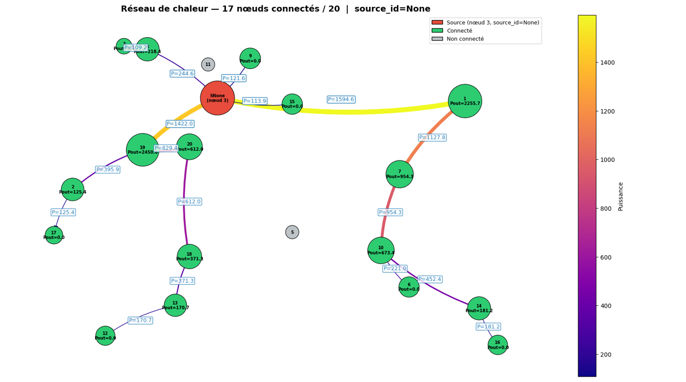
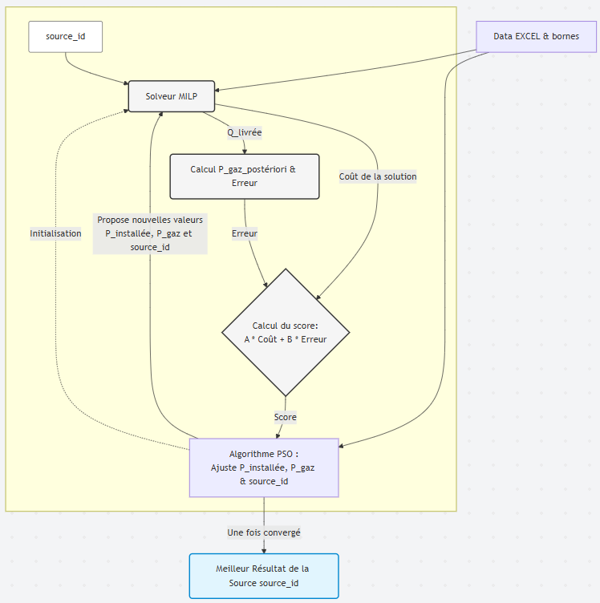
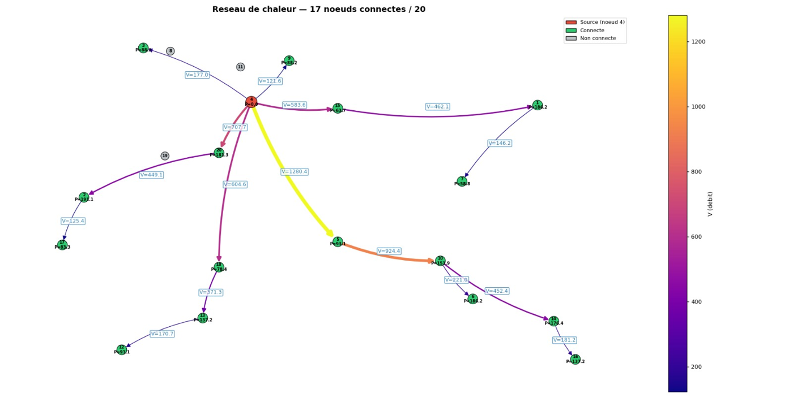
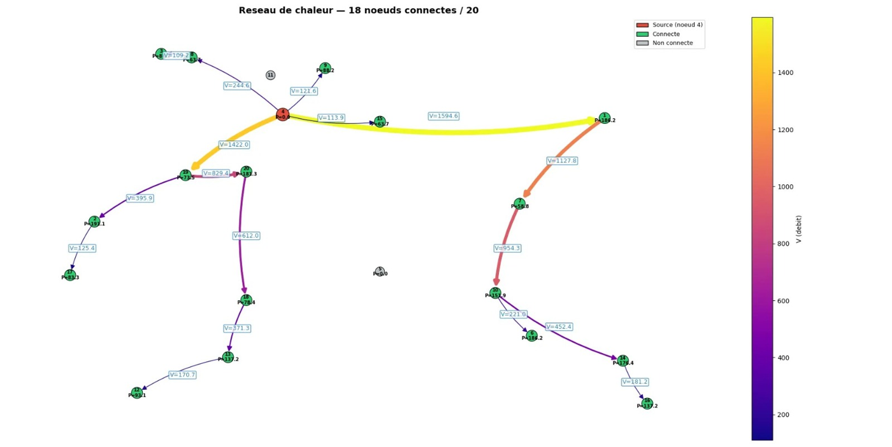
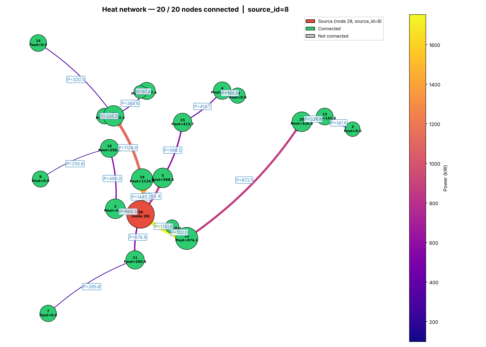

# District Heating Network Optimization (MILP + PSO)

**IMT Atlantique · PRONTO project "Chaud pour décider ?" · Semester 6, 2025–2026**

A decision-support tool for a small town that wants to build a **district heating network**: a set of underground pipes that carries heat from a central source to buildings. The tool decides **which buildings to connect, which pipes to lay and how much heat flows through each pipe**, at minimum cost, while keeping the network fair across the town and within the capacity of the heat source. The result is drawn as a map that non-experts can read.

<p align="center">
  
  <br><em>Optimal network for one heat source (phase 1, equity on surface). Red: source. Green: connected buildings. Grey: not connected. Pipe color and width: heat flow (kW).</em>
</p>

📄 **Reports:** English: [Final report](docs/reports/PRONTO_final_report_EN.pdf) · [Mathematical model](docs/reports/PRONTO_math_model_EN.pdf) | Français : [Rapport final](docs/reports/PRONTO_final_report_FR.pdf) · [Modèle mathématique](docs/reports/PRONTO_math_model_FR.pdf)

---

## Contents

1. [The problem](#the-problem)
2. [Repository layout](#repository-layout)
3. [Mathematical model (phase 1)](#mathematical-model-phase-1-one-known-source)
4. [Extension to several candidate sources (phase 2)](#extension-to-several-candidate-sources-phase-2)
5. [Results](#results)
6. [Getting started](#getting-started)
7. [Team](#team)

---

## The problem

The town hall gave us 20 buildings (houses, public services, businesses) with their coordinates, floor surface and heat demand, plus the cost and heat-loss data of every possible pipe. The project had two phases:

| Phase | Situation | Method |
|---|---|---|
| **1** | One heat source, position and maximum power known | Linear model solved exactly as a **MILP** (Mixed-Integer Linear Program) |
| **2** | 10 candidate sources, to choose together with their installed power and gas share | The cost is no longer linear, so a **PSO** metaheuristic searches the source settings and calls the **MILP** to design the network for each one |

What the town hall asked for (requirements specification):

| Requirement | Target |
|---|---|
| Minimize cost | Lowest cost per kWh, ideally below 0.08 €/kWh |
| Do not connect everyone at any price | Minimize investment per kWh |
| Connect enough buildings | About half of the buildings |
| Respect the source | Peak demand plus losses never above the source capacity (3,500 kW in phase 1) |
| Fair spread | Balance housing (30 %), public services (30 %) and businesses (20 %) |
| Readable result | A network map approved by the town hall |
| Low environmental cost | Light computation (green coding) |

---

## Repository layout

```
.
├── code/
│   ├── phase1_single_source/          # Jupyter notebooks, one per equity rule
│   │   ├── equity_building_type.ipynb
│   │   ├── equity_demand_threshold.ipynb
│   │   └── equity_surface_threshold.ipynb   # version kept
│   └── phase2_multi_source/
│       ├── milp.py                    # network design for one source (PuLP)
│       ├── pso.py                     # particle swarm around the MILP, parallel
│       ├── visualization.py           # draws the network map
│       ├── tests.py                   # unit tests
│       └── utils.py                   # paths, Excel reader, solution writer
├── data/
│   └── phase2_input_unknown_source.xlsx
├── results/
│   ├── phase2_solution.txt            # pipes built and heat flows
│   └── phase2_heat_network.png
├── docs/
│   ├── reports/                       # final report + mathematical model (EN + FR)
│   └── images/
├── requirements.txt
└── README.md
```

---

## Mathematical model (phase 1: one known source)

The town is a graph: each building is a **node** $`i \in V`$ and each possible pipe between two buildings is an **edge** $`e_{ij}`$. The source is the node $`v_0`$.

### Parameters

| Symbol | Meaning | Unit |
|---|---|---|
| $`l_{ij}`$ | Length of pipe $`e_{ij}`$: $`l_{ij} = \sqrt{(x_j-x_i)^2 + (y_j-y_i)^2}`$ | m |
| $`c^{fix}_{ij}`$, $`c^{var}_{ij}`$ | Fixed and variable (per kW) cost of pipe $`e_{ij}`$ | €/m, €/(m·kW) |
| $`c^{om}_{ij}`$ | Maintenance cost of pipe $`e_{ij}`$ | €/year |
| $`c^{heat}`$, $`c^{rev}`$ | Heat generation cost and selling price | €/kWh |
| $`\theta^{fix}_{ij}`$, $`\theta^{var}_{ij}`$ | Fixed and variable heat losses on $`e_{ij}`$ | kW/m, kW/(kW·m) |
| $`d_j`$ | Peak demand of node $`j`$ | kW |
| $`D_j = S_j \times SC_j`$ | Yearly demand: surface × consumption per m² | kWh/year |
| $`C^{max}_{ij}`$ | Maximum capacity of pipe $`e_{ij}`$ | kW |
| $`Q^{max}`$ | Maximum power the source can deliver | kW |
| $`\alpha`$, $`\lambda`$, $`\beta`$ | Investment annuity factor, connection quota, competition effect | – |
| $`\mu_t`$, $`N_{jt}`$ | Minimum share for building type $`t`$; $`N_{jt}=1`$ if node $`j`$ is of type $`t`$ | – |

### Decision variables

- $`X_{ij} \in \{0,1\}`$: do we build the pipe from $`i`$ to $`j`$?
- $`p^{in}_{ij} \ge 0`$: power entering pipe $`e_{ij}`$
- $`p^{out}_{ij} \ge 0`$: power leaving pipe $`e_{ij}`$, after losses and after serving node $`j`$

### Objective: minimize the net yearly cost

```math
Z = \underbrace{\sum_{i,j} X_{ij}\, l_{ij}\left(c^{om}_{ij} + \alpha\, c^{fix}_{ij}\right)}_{\text{maintenance + fixed pipe cost}}
  + \underbrace{\sum_{i,j} \alpha\, c^{var}_{ij}\, l_{ij}\, p^{in}_{ij}}_{\text{variable pipe cost}}
  + \underbrace{\sum_{i,j} \lambda\, X_{ij}\, c^{heat} D_j}_{\text{heat generation}}
  - \underbrace{\sum_{i,j} c^{rev} D_j\, \lambda\, X_{ij}}_{\text{revenue}}
```

Because the network is a tree, $`\sum_i X_{ij} = 1`$ exactly when building $`j`$ is connected, so the last two terms count the heat sold to the connected buildings. A **negative** $`Z`$ means the network earns more than it costs.

### Constraints

| Constraint | Equation |
|---|---|
| **Tree structure:** each node has at most one parent, and no pipe from a node to itself | $`\displaystyle\sum_{i \neq j} X_{ij} \le 1 \;\; \forall j, \qquad X_{ii} = 0`$ |
| **One direction** per pair of nodes | $`X_{ij} + X_{ji} \le 1 \quad \forall i \neq j`$ |
| **Heat balance on a pipe:** what comes out = what goes in, minus losses, minus what node $`j`$ consumes | $`p^{out}_{ij} = \left(1 - \theta^{var}_{ij} l_{ij}\right) p^{in}_{ij} - \left(d_j \beta \lambda + \theta^{fix}_{ij} l_{ij}\right) X_{ij}`$ |
| **Energy conservation** at every node except the source | $`\displaystyle\sum_{i} p^{out}_{ij} - \sum_{k} p^{in}_{jk} = 0 \quad \forall j \neq v_0`$ |
| **Pipe capacity:** no flow in a pipe that is not built | $`p^{in}_{ij} \le C^{max}_{ij} X_{ij}`$ |
| **Nothing flows into the source** | $`\displaystyle\sum_{i} X_{i v_0} = 0`$ |
| **Source capacity** | $`\displaystyle\sum_{j} p^{in}_{v_0 j} \le Q^{max}`$ |

### Three ways to write fairness (equity)

We modelled the town hall's fairness requirement in three ways, with one notebook for each:

| Equity rule | Equation | Notebook |
|---|---|---|
| **Building type:** each type gets at least its share of the pipes | $`\displaystyle\sum_{i \neq j} N_{jt} X_{ij} \ge \mu_t \sum_{i \neq j} X_{ij} \quad \forall t`$ | `equity_building_type.ipynb` |
| **Demand threshold:** connected buildings represent at least $`\gamma`$ of the total demand | $`\displaystyle\sum_{i,j} D_j X_{ij} \ge \gamma \sum_i D_i`$ | `equity_demand_threshold.ipynb` |
| **Surface threshold:** connected buildings cover at least $`\gamma`$ of the total surface | $`\displaystyle\sum_{i,j} S_j X_{ij} \ge \gamma \sum_i S_i`$ | `equity_surface_threshold.ipynb` |

We used $`\gamma = 0.4`$ and **kept the surface rule**. For a town, it seemed fairer to spread the network across neighbourhoods than to follow only the biggest consumers.

---

## Extension to several candidate sources (phase 2)

In phase 2, the town can place the source at one of **10 candidate sites**. Each source mixes renewable heat and gas:

- installed power $`P`$, of which renewable $`P_{ENR} = \min(P, P^{max}_{ENR})`$ and gas $`P_{gas} = P - P_{ENR}`$
- heat delivered per year $`Q = 8766\,\text{h} \times \sum_j p^{in}_{sj}`$
- a **50 % investment subsidy** when the gas share $`g`$ is at most 50 %

For a fixed source $`s`$, power $`P`$ and gas share $`g`$, the MILP (`milp.py`) keeps the phase 1 constraints (with the surface equity rule). The heat generation term is replaced by:

```math
Z(s, P, g) = \dots + \left(P_{gas}\, c^{inv}_{gas} + P_{ENR}\, c^{inv}_{ENR}\right)\left(1 - 0.5\cdot\mathbb{1}[g \le 0.5]\right) + Q\, g\, c_{gas}
```

and the source capacity becomes $`\sum_j p^{in}_{sj} \le P`$.

The gas share $`g`$ depends on $`P`$ and $`Q`$, which makes the problem **non-linear**. So we wrapped the MILP in a **particle swarm optimization (PSO)**. Each "particle" is a candidate pair $`(P, g)`$, and its score is the MILP cost plus a penalty that grows when the assumed gas share disagrees with the gas share recomputed afterwards:

```math
\text{score}(P, g) = A \cdot Z^*(s, P, g) + B \cdot \left|\, g_{post}(P) - g \,\right| \cdot Q \cdot c_{gas}, \qquad A = 1,\; B = 100
```

<p align="center">
  
  <br><em>The hybrid loop: the PSO proposes (P, g), the MILP designs the network and returns its cost, and the score feeds back into the swarm.</em>
</p>

The particles of a swarm are evaluated **in parallel** (`multiprocessing.Pool`). The search runs for each of the 10 sources, and the best source is the one with the lowest score.

---

## Results

### Phase 1: one source

| Equity rule | Buildings connected | Optimal cost $`Z`$ |
|---|---|---|
| Building type | 17 / 20 | −708,531.93 € |
| Demand threshold ($`\gamma = 0.4`$) | 18 / 20 | −711,219.31 € |
| **Surface threshold ($`\gamma = 0.4`$), kept** | **18 / 20** | **−711,219.31 €** |

All three runs reached solver status **Optimal**. The negative costs mean the network is profitable over the period modelled.

<table>
  <tr>
    <td></td>
    <td></td>
  </tr>
  <tr>
    <td align="center"><em>Equity by building type.</em></td>
    <td align="center"><em>Equity by demand threshold.</em></td>
  </tr>
</table>

### Phase 2: choosing the source

<p align="center">
  
  <br><em>Network from the final version of the code (<code>results/phase2_solution.txt</code>): source S9 (node 28), all 20 buildings connected.</em>
</p>

> **Known issue.** The PSO run presented in the report picked source S5 with 4,931.65 kW installed and a 15.6 % gas share. That result is **not valid**: an error in the gas-share computation meant the real gas share was 100 %, so the subsidy would not apply. Because that run took about **20 hours** (on 15 nodes), we did not have time to rerun it after the fix. The map above is the output of the final code. It has not been rechecked against the report, so check `calculate_pgaz_posteriori` in `pso.py` before relying on phase 2 numbers.

### Possible improvements

- Create the `multiprocessing.Pool` once, before the PSO loop, instead of at every iteration.
- Run the 10 candidate sources in parallel instead of one after another.
- Look at the nodes that lose more than 40 % of their heat, to check whether the chosen source site makes sense.

---

## Getting started

### Install

```bash
pip install -r requirements.txt
```

The code needs **PuLP 2.x**. PuLP 3 removed `LpVariable.dicts`, which the models use.

### Phase 2 (scripts)

```bash
cd code/phase2_multi_source
python tests.py          # unit tests: MILP status, bounds, gas share
python pso.py            # full PSO + MILP search over the 10 sources (long)
python visualization.py  # redraws results/phase2_heat_network.png from results/phase2_solution.txt
```

`pso.py` uses a small swarm by default (4 particles, 5 iterations, 4 cores). The run in the report used 15 particles, up to 30 iterations and a minimum installed power of 850 kW. Change the arguments of `run_parallel_pso` to reproduce it.

### Phase 1 (notebooks)

Open a notebook in `code/phase1_single_source/` with Jupyter or Google Colab. On Colab, the first cell asks you to upload the input file. Locally, it reads `data/phase1_input_known_source.xlsx`.

> The phase 1 input file (`InputDataSourceConnue.xlsx` in the original project) is not in this repository yet. The notebooks keep their saved outputs, so you can still read the results.

---

## Team

Project n°8, team 1, supervised by **Timothé Gronier**:

| Member | Role |
|---|---|
| Alae ELLIAMOUDI | Mathematical modelling, project management (planning, Gantt chart) |
| Jeanne CHAUVEL | Mathematical modelling |
| Margaux CORFEC | Mathematical modelling, contact with the supervisor |
| Paul DE SAILLY | Implementation (MILP, debugging of the constraints) |
| Omar AMARA | Implementation (MILP, PSO with parallel evaluation, visualization) |

Reference: J. Dorfner and T. Hamacher, *Large-Scale District Heating Network Optimization*, IEEE Transactions on Smart Grid, vol. 5, no. 4, 2014.
